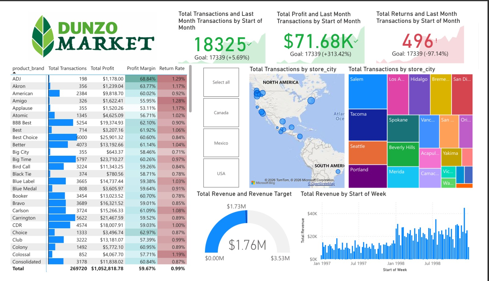

# 🛒 Dunzo Market – Power BI Retail Performance & Profitability Dashboard

## 📌 Project Overview

Developed an interactive **Power BI retail analytics dashboard** to analyze Dunzo Market transaction data. The dashboard enables stakeholders to monitor key performance indicators, evaluate brand-wise and city-wise performance, track profitability and return rates, and assess overall business efficiency through dynamic and interactive visualizations.

---

---

## 🎯 Project Objectives

* Analyze total transactions, revenue, profit, and profit margins
* Evaluate brand-wise and city-wise performance
* Track return rates and identify operational inefficiencies
* Compare monthly performance against business targets
* Deliver actionable insights to support retail and operational decision-making

---

## 🗂 Dataset Information

* **Source:** Retail Transactions Dataset (Dunzo Market)
* **Time Period:** Historical transactional data

**Data Includes:**

* Transaction count and revenue
* Profit and profit margins
* Return rates
* Product brand details
* Store city and country information
* Time-based fields (Month, Week)

---

## 📊 Key KPIs

* Total Transactions
* Total Revenue
* Total Profit
* Profit Margin
* Return Rate
* Monthly Transactions vs Target

---

## 📈 Dashboard Features

### Brand Performance Analysis

* Brand-wise transactions, profit, and profit margins
* Identification of top-performing and low-performing brands
* Brand-level return rate comparison

### City & Regional Analysis

* City-wise transaction volume and revenue contribution
* Regional performance comparison using interactive maps
* Country-level filtering and drill-downs

### Time-Based Performance

* Monthly and weekly trends in transactions and revenue
* Target vs actual performance monitoring
* Trend analysis for operational planning

---

## 🛠 Tools & Technologies

* Power BI Desktop
* Power Query (M Language) for data transformation
* DAX for KPI and performance calculations
* Interactive slicers and drill-down functionality

---

## 📌 Key Business Insights

* Identified top-performing brands contributing the highest profit
* Major cities drive the majority of transaction volume
* Profit margins remain consistent across leading brands
* Low return rates indicate efficient retail operations
* Clear revenue trends support performance benchmarking

---

## 👩‍💻 Author

**Neha Maurya**

---
